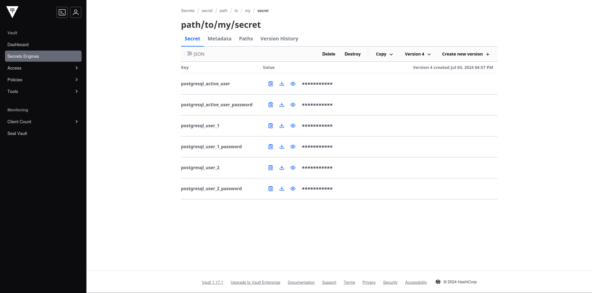

<h1 align="center" style="color: #F2A007;">
  propeller - automated database secret rotation.
</h1>

<p align="center">
  
  <br />
  <i>
    propeller is a secret rotation tool for applications running in Kubernetes,
    <br/>using HashiCorp Vault and ArgoCD.
  </i>
</p>

<p align="center">
  <a href="https://github.com/postfinance/propeller/actions/workflows/build.yml">
    
  </a>
  <a href="https://github.com/postfinance/propeller/blob/main/LICENSE">
    
  </a>
  <a href="https://github.com/postfinance/propeller/releases">
    
  </a>
</p>

<hr />

<div style="padding: 15px; border: 1px solid #ffeeba; border-radius: 4px; color: #856404; background-color: #fff3cd; margin-bottom: 20px;">
  <strong>Note:</strong> This project is still under construction. Features may be incomplete or subject to change.
</div>

<hr />

## Target Architecture

`propeller` is designed to seamlessly integrate with a specific application deployment architecture commonly used in modern environments:

- **Containerized Applications:** Applications are deployed within a [Kubernetes](https://kubernetes.io/) cluster for scalability and efficient resource management.
- **PostgreSQL Database:** Data is persisted in a robust [PostgreSQL](https://www.postgresql.org/) database, known for its reliability and feature set.
- **Vault for Secrets Management:** Sensitive information like passwords and API keys are securely stored and managed within [Vault](https://www.hashicorp.com/products/vault) for enhanced security.
- **ArgoCD for GitOps Automation:** [ArgoCD](https://argoproj.github.io/cd/) is utilized for GitOps principles, enabling declarative management of infrastructure and applications through Git repositories.
  Importantly, ArgoCD can also manage the synchronization of secrets from Vault using plugins like [@postfinance/kubectl-vault_sync](https://github.com/postfinance/kubectl-vault_sync).

### Visual Representation


<small><a href="./docs/application-architecture.puml">Source</a>.</small>

`propeller` can either run as a CronJob in Kubernetes, or as part of any scheduled pipeline within your CI/CD environment.

## Configuration

Propeller relies on a [configuration file](#configuration-file-yaml) and [environment variables](#environment-variables) to function correctly.

Once you're done configuring, [initialize Vault](#initializing-vault-for-secret-management).
And that's it: Proceed to [rotate your secrets](#rotating-secrets).

### Configuration File (YAML)

All [commands](#commands) in `propeller` accept the `-c <config_path>` argument to specify the location of your configuration file.
If you don't provide the argument, the tool will default to `config.yml` in the current directory.

The configuration file is in YAML format and has the following structure:

| Root       | Property                 | Description                                                                              | Required?                  |
| ---------- | ------------------------ | ---------------------------------------------------------------------------------------- | -------------------------- |
| `argo_cd`  |                          | ArgoCD-related configuration                                                             | ✔️                         |
|            | `application`            | The name of the application you'd like to synchronise inside ArgoCD                      | ✔️                         |
|            | `base_url`               | The base URL of your ArgoCD instance                                                     | ✔️                         |
|            | `danger_accept_insecure` | Whether to accept insecure/self-signed SSL certificates (not recommended for production) | ❌ (default: `false`)      |
|            | `sync_timeout_seconds`   | The timeout in seconds for the synchronization process                                   | ❌ (default: `60`)         |
| `postgres` |                          | PostgreSQL database configuration                                                        |                            |
|            | `host`                   | The hostname or IP address of the PostgreSQL server                                      | ✔️ (if `postgres` is used) |
|            | `port`                   | The port number on which PostgreSQL is running                                           | ✔️ (if `postgres` is used) |
|            | `database`               | The name of the PostgreSQL database to connect to                                        | ✔️ (if `postgres` is used) |
| `vault`    |                          | HashiCorp Vault configuration                                                            |                            |
|            | `base_url`               | The base URL of your Vault instance                                                      | ✔️                         |
|            | `path`                   | The path to the secret in Vault                                                          | ✔️                         |

**Note:**

- ✔️ indicates a required field
- ❌ indicates an optional field
- Fields marked as required under specific conditions (e.g., "if `postgres` is used") are only required if you're using that particular feature or integration.
  Right now only PostgreSQL is supported, but that might change in the future.

Here's an example configuration file with explanations:

```yaml
# ArgoCD configuration (required)
argo_cd:
  application: 'propeller'
  base_url: 'http://localhost:8080'
  sync_timeout_seconds: 60

# PostgreSQL configuration (required if using a PostgreSQL database)
postgres:
  host: 'localhost'
  port: 5432
  database: 'demo'

# Vault configuration (required)
vault:
  base_url: 'http://localhost:8200'
  path: 'path/to/my/secret'
```

Make sure to replace the placeholder values with your actual ArgoCD details, database connection information, and the desired Vault path.

### Environment Variables

All sensitive information is passed to Propeller using environment variables.
**Make sure to keep all sensitive information/tokens stored securely!**
_Never_ include any token directly in the configuration file or commit it to version control.

#### ArgoCD Authentication Token (`ARGO_CD_TOKEN`)

Propeller supports optional authentication with ArgoCD using the `ARGO_CD_TOKEN` environment variable.
If provided, this token will be used to authenticate with your ArgoCD instance.

**Setting the `ARGO_CD_TOKEN` (Optional):**

If you want to use authentication with ArgoCD, you can set the `ARGO_CD_TOKEN` environment variable in your shell:

```shell
export ARGO_CD_TOKEN=<your_argocd_token>
```

Replace `<your_argocd_token>` with your actual ArgoCD token.
If the `ARGO_CD_TOKEN` is not set, Propeller will attempt to connect to ArgoCD without authentication.
This might be suitable for local development or environments where ArgoCD does not require authentication, but is not recommended in productive environments!

#### Vault Authentication Token (`VAULT_TOKEN`)

In addition to the configuration file, Propeller **requires** a `VAULT_TOKEN` environment variable.
This token is used to authenticate with your Vault instance. Unauthenticated access is prohibited.

**Setting the `VAULT_TOKEN`:**

Before running any Propeller command, you need to set the `VAULT_TOKEN` environment variable.
Here's how you can do it in your shell:

```shell
export VAULT_TOKEN=<your_vault_token>
```

Replace `<your_vault_token>` with your actual Vault token.

## Commands

### Initializing Vault for Secret Management

The `propeller init-vault` command is the first step in setting up your database secret rotation process.
It creates the necessary structure within your Vault instance to securely store and manage your PostgreSQL credentials.

**Command Usage:**

```cookie
propeller init-vault [OPTIONS]
```

#### Options

```shell
Initialize a Vault path with the necessary structure for secret management.

This command prepares the Vault backend for subsequent secret rotation operations.

Usage: propeller.exe init-vault [OPTIONS]

Options:
  -c, --config-path <CONFIG_PATH>
          Path to the configuration file (default: config.yml)

          [default: config.yml]

  -h, --help
          Print help (see a summary with '-h')

  -V, --version
          Print version
```

Additionally, have a look at the ["Configuration"](#configuration) chapter.

#### Result

After running the command, the specified Vault path will contain a JSON secret with the following structure:

```json
{
  "postgresql_active_user": "TBD",
  "postgresql_active_user_password": "TBD",
  "postgresql_user_1": "TBD",
  "postgresql_user_1_password": "TBD",
  "postgresql_user_2": "TBD",
  "postgresql_user_2_password": "TBD"
}
```

**Note that any previously present secrets in this path will be lost in the process!**

The "TBD" placeholders indicate that these values _must_ be filled once with the initial values before continuing the [rotation process](#rotating-secrets).

**Screenshot of initialized Vault secret:**

[](img/initial-vault-structure.png)

### Rotating Secrets

Once Vault has been initialized, you're ready to frequently rotate your database secrets.

**Command Usage:**

```cookie
propeller rotate [OPTIONS]
```

#### Options

```shell
Rotate PostgreSQL database secrets.

This command orchestrates the process of generating new secrets, updating the database, and storing the new secrets in Vault.

Usage: propeller.exe rotate [OPTIONS]

Options:
  -c, --config-path <CONFIG_PATH>
          Path to the configuration file (default: config.yml)

          [default: config.yml]

  -p, --password-length <PASSWORD_LENGTH>
          The length of the randomly generated alphanumeric password

          [default: 20]

  -h, --help
          Print help (see a summary with '-h')

  -V, --version
          Print version
```

Additionally, have a look at the ["Configuration"](#configuration) chapter.

#### Result

If all goes well, the active user will have been switched.
The passwords of both the user 1 and 2 will have been rotated.
The binary makes sure that your running application is in sync at all times!

#### Sequence Diagram "Switch"


<small><a href="./docs/switch-workflow.puml">Source</a>.</small>

<hr/>

## Feedback and Contributions

We value _all_ of your feedback and contributions, including 💌 love letters , 💡 feature requests, 🐞 bug reports, and ✍️ grammatical nitpicks in the docs.
Please [create an issue](https://github.com/postfinance/propeller/issues/new), open a pull request, or reach out to [@postfinance](https://github.com/postfinance).

**Welcome to the bottom of the README club! Since you've come this far, go ahead and smash that like and subsc… er, uh, give this project a ⭐️ on GitHub! 🙏🏼**

<small>Hats off to [@pmcelhaney](https://github.com/pmcelhaney/counterfact) for this amazing line that we couldn't resist stealing.. er, uh, which inspired us. Hope you don't mind 😏</small>
